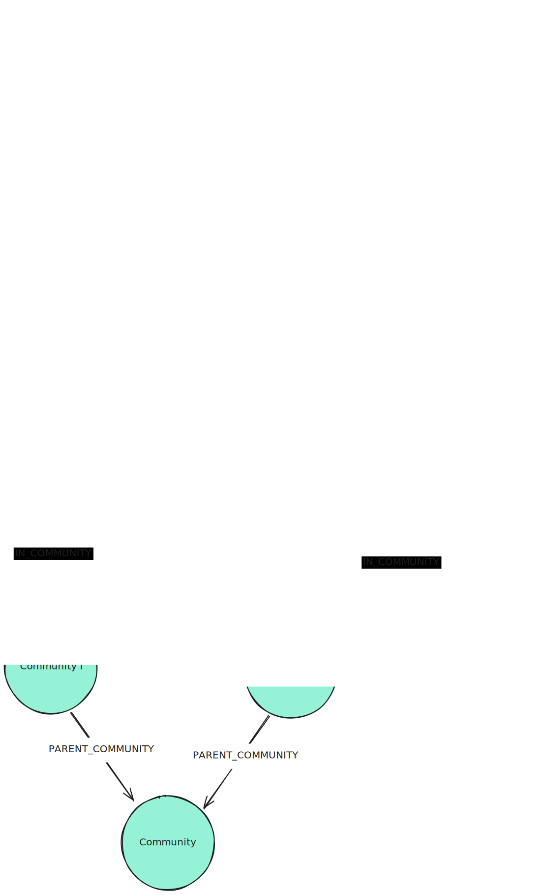

## Alternative Names

- Microsoft GraphRAG
- Global Retriever
- Query Focused Summarization

## Required Graph Shape


[Lexical Graph with Extracted Entities and Community Summaries](/reference/knowledge-graph/lexical-graph-extracted-entities-community-summaries)

## Context

Certain questions that can be asked on a whole dataset do not just relate to things present in some chunks but rather search for an overall message that is overarching in the dataset. 
The previously mentioned patterns aren’t suited to answer these kinds of “global” questions.

## Description

Given the user question and a given Community level, the Community Summaries are retrieved and given to the LLM.

## Usage

This pattern is useful for questions that have a global character. 
Examples would be summarizing the content of the whole database or looking for topic structures across the whole data. 
The effort of setting up the required Graph Pattern is quite high since there are a lot of steps to be taken: entity & relationship extraction, Community detection and Community summarizations. 
It needs to be considered which of these tasks shall be executed by LLMs and which tasks can be handled differently to keep the pre-processing cost acceptable.

## Required pre-processing

In addition to extracting entities and their relationships, we need to form hierarchical communities within the Domain Graph. 
This can be done by using the Louvain or Leiden clustering algorithm. For every community, an LLM summarizes the entity and relationship information into Community Summaries.

## Retrieval query

The default implementation of this approach does not use vector search to fetch communities similar to the question.
It simply fetches all Community Summaries of a given level and passes all of them (possibly in batches) to the LLM.

```
MATCH (c:__Community__)
WHERE c.level = $level
RETURN c.full_content AS output
```

## Variants

There are several variations in which you could use the Lexical Graph with extracted entities, communities, and community summaries:

* A [Local Retriever](/reference/graphrag/local-retriever) could start by executing a vector search on the entity embeddings and traversing to related entities, chunks, or communities (e.g., see Integrating Microsoft GraphRAG into Neo4j).

* Depending on the question, we could also execute a vector similarity search on embeddings of the Community Summaries first to identify which subgraph is relevant for the question, then traverse from the communities to its entities and chunks to retrieve additional information.

* [DRIFT](https://www.microsoft.com/en-us/research/blog/introducing-drift-search-combining-global-and-local-search-methods-to-improve-quality-and-efficiency/) is a multi-stage approach that first executes a generic or vector based community search and then generates additional questions for local search from those results. All results are then re-ranked and used together for generating the final answer.

## Further reading

- [From Local to Global:A Graph RAG Approach to Query-Focused Summarization](https://arxiv.org/pdf/2404.16130) (April 2024)
- [Implementing 'From Local to Global' GraphRAG with Neo4j and LangChain: Constructing the Graph](https://neo4j.com/developer-blog/global-graphrag-neo4j-langchain/) (July 2024)
- [Integrating Microsoft GraphRAG into Neo4j](https://towardsdatascience.com/integrating-microsoft-graphrag-into-neo4j-e0d4fa00714c) (July 2024)
- [Introducing DRIFT Search: Combining global and local search methods to improve quality and efficiency - Microsoft Research](https://www.microsoft.com/en-us/research/blog/introducing-drift-search-combining-global-and-local-search-methods-to-improve-quality-and-efficiency/)

## Existing Implementations

- [Microsoft GraphRAG](https://github.com/microsoft/graphrag)
<!-- not supported yet [Neo4j GraphRAG]() -->
- [LLM Knowledge Graph Builder with GDS](https://neo4j.com/labs/genai-ecosystem/llm-graph-builder/)