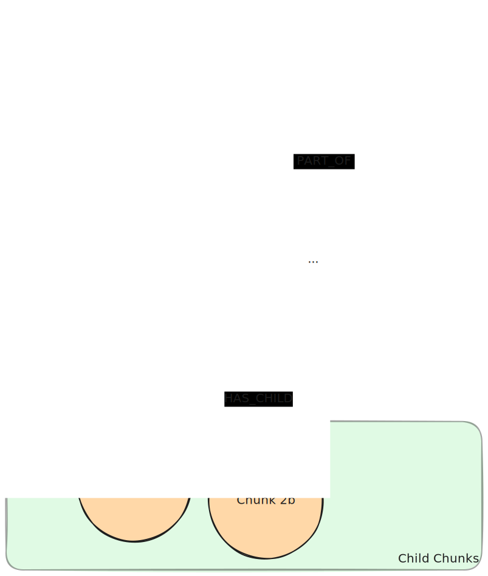

## Alternative Names

- Parent-Document-Retriever

## Required Graph Shape


[Parent-Child Lexical Graph](/reference/knowledge-graph/lexical-graph-parent-child/)

## Context 

Text embeddings represent a text’s semantic meaning. 
A more narrow piece of text will yield a more meaningful vector representation since there is less noise from multiple topics. 
However, if the LLM only receives a small piece of information for answer generation, the information might be missing context. 
Retrieving the broader surrounding text that the found information resides within solves the problem.

## Description

The user question is embedded using the same embedder that has been used before to create the Chunk embeddings. 
A vector similarity search is executed on the Child Chunk embeddings to find k (number previously configured by developer / user) most similar Chunks. 
The Parent of the found Child Chunks are retrieved and additional metadata from the parent returned.
Optionally chunks for the same parent are aggregated and their scores are averaged or picked by max.

## Usage

This pattern is a useful evolution of the [Basic Retriever](/reference/graphrag/basic-retriever/). 
It is especially useful when several topics are covered in a chunk which subsequently influence the embedding negatively while smaller chunks will have more meaningful vector representations which can then lead to better similarity search results. 
With limited additional effort, better results can be obtained.

## Required pre-processing

Split documents into (bigger) chunks (parent chunks) and further split these chunks into smaller chunks (child chunks). 
Use an embedding model to embed the text content of the child chunks. 
Note that it isn’t necessary to embed the parent chunks since they are only used for the answer generation and not for the similarity search.

## Retrieval Query

```cypher
MATCH (node)<-[:HAS_CHILD]-(parent)
WITH parent, collect(node.text) as chunks, max(score) AS score // deduplicate parents
RETURN parent.title + reduce(r="", c in chunks | r + "\n\n" + c.text) AS text, 
       score, {source:parent.url} AS metadata
```
## Further reading

- [Advanced Retriever Techniques to Improve Your RAGs](https://towardsdatascience.com/advanced-retriever-techniques-to-improve-your-rags-1fac2b86dd61) (Damian Gil, April 2024)
- [Implementing advanced RAG strategies with Neo4j](https://blog.langchain.dev/implementing-advanced-retrieval-rag-strategies-with-neo4j/) (November 2023)

## Existing Implementations

- [Langchain Retrievers: Parent Document Retriever](https://python.langchain.com/v0.1/docs/modules/data_connection/retrievers/parent_document_retriever/)

## Example Implementations

- [Langchain Templates: Neo4j Advanced RAG](https://github.com/langchain-ai/langchain/blob/master/templates/neo4j-advanced-rag/neo4j_advanced_rag/retrievers.py)

## Similar Patterns

Similar patterns can be implemented on [Lexical Graphs With a Sibling Structure](/reference/knowledge-graph/lexical-graph-sibling-structure/) or [Lexical Graphs With a Hierarchical Structure](/reference/knowledge-graph/lexical-graph-hierarchical-structure/), where the additional context does not come from retrieving just the parent document but sibling documents or a previously set depth of structures. 
The Lexical Graph With Sibling Structure is, for example, currently implemented in [Neo4j’s LLM Knowledge Graph Builder](https://neo4j.com/labs/genai-ecosystem/llm-graph-builder/).

Note that there are two kinds of retrievers possible on a Lexical Graph With a Hierarchical Structure:

* **Bottom-up**: Execute retrieval on leaf nodes and retrieve other chunks higher up in the tree (see [Going Meta — Ep 24: KG+LLMs: Ontology driven RAG patterns](https://www.youtube.com/watch?v=5_WXr0GtVas&list=PL9Hl4pk2FsvX-5QPvwChB-ni_mFF97rCE&index=5))
* **Top-down**: Use the top-level nodes to determine which subtree(s) to consider for retrieval. Iterate this methodology until the set of nodes for the similarity search is reasonably narrowed down (see [RAG Strategies — Hierarchical Index Retrieval](https://pixion.co/blog/rag-strategies-hierarchical-index-retrieval)).


